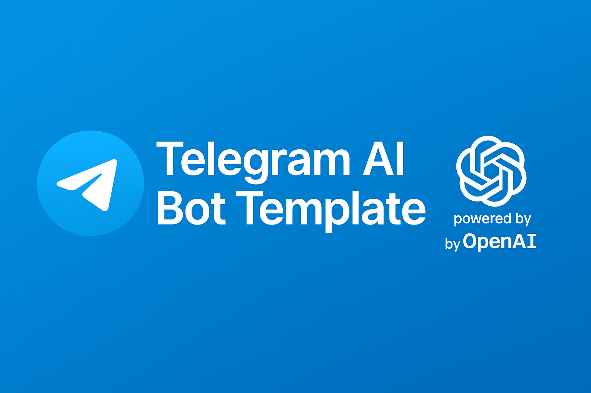

# 🤖 Telegram AI Bot Template



A minimal **Telegram Bot** powered by **OpenAI (ChatGPT)** — ready to clone and deploy in 5 minutes ⚡

---

## 🪄 Features
- ChatGPT integration via OpenAI API
- Auto replies to messages in Telegram
- Clean Node.js structure
- `.env` support for easy configuration

---

## 🚀 Setup

### 1️⃣ Clone the repo
```bash
git clone https://github.com/mcieric/telegram-ai-bot-template
cd telegram-ai-bot-template
npm install
```

### 2️⃣ Configure environment
Copy the example file:
```bash
cp .env.example .env
```
Then edit `.env` with your keys:
- Get a Telegram bot token from [@BotFather](https://t.me/BotFather)
- Get an OpenAI API key from [platform.openai.com](https://platform.openai.com)

### 3️⃣ Run the bot
```bash
node bot.js
```

---

## 💡 Example
In Telegram:
> **You:** Hello bot  
> **ZenBot:** Hey Zen ⚡ How can I assist you today?

---

## 🧱 Tech Stack
- Node.js  
- OpenAI API  
- node-telegram-bot-api  

---

## 🌟 Give it a Star
If this helped you, please ⭐ star this repo — it means a lot!

---
Made with ❤️ by [Zeneric](https://github.com/mcieric)
